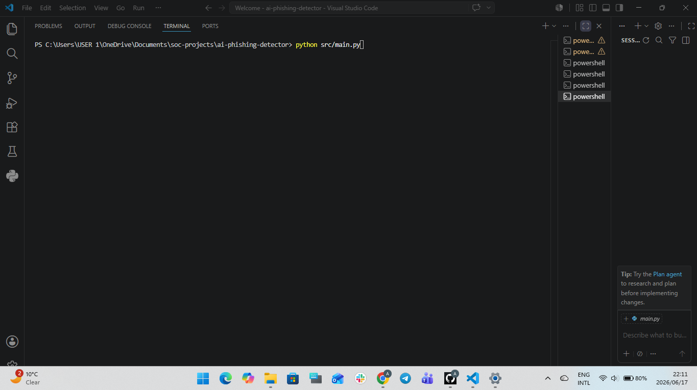
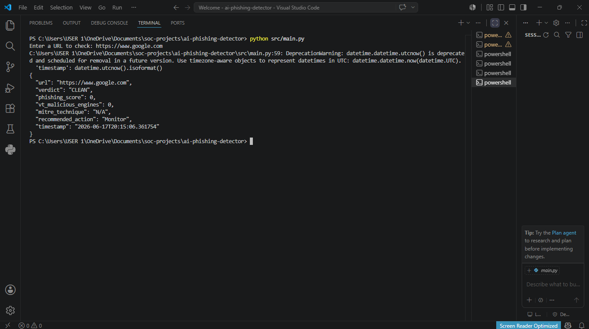
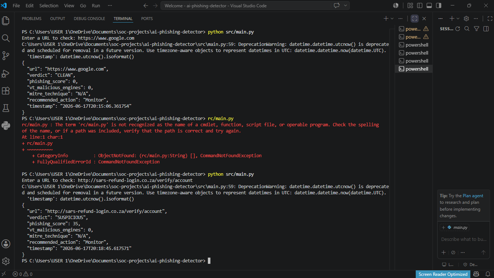
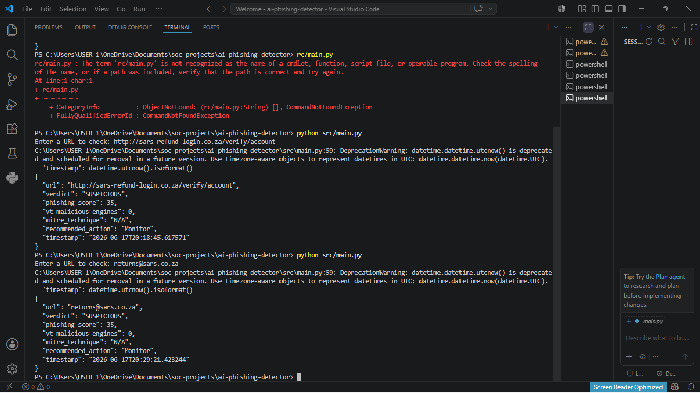
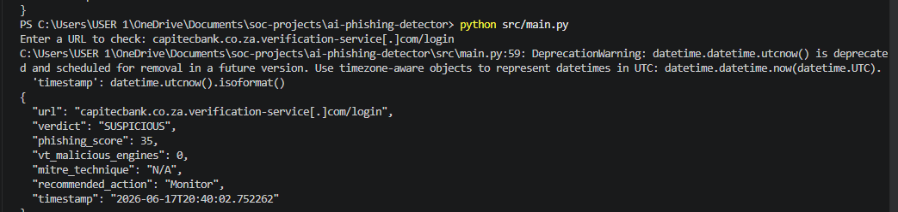

# Automated AI-Driven Phishing Detection Engine (SARS Threat Profile)

## Disclaimer and Compliance Notice
This project is developed strictly for educational purposes, defensive blueprint testing, and SOC awareness training. The heuristic detection vectors evaluated herein model regional attack methodologies documented by financial institutions and regulatory frameworks within South Africa. This application does not interact with, intercept, or exploit any live institutional infrastructure.

---

## Executive Summary and Regional Threat Landscape
During the historical 2024 and 2025 South African filing periods, financial crime modules and risk mitigation bodies noted an unprecedented surge in targeted social engineering campaigns. Malicious actors launched high-pressure, coordinated "smishing" (SMS phishing) and email phishing operations impersonating the South African Revenue Service (SARS).

These attacks targeted the general public and corporate personnel by utilizing look-alike URLs, typosquatted Top-Level Domains (TLDs), and deep subdirectory trees specifically crafted to harvest banking credentials and hijack digital profiles. 

This project establishes a proactive, automated Blue-Team utility. It ingests suspicious URLs, evaluates lexical and structural heuristics, and integrates seamlessly with Open-Source Threat Intelligence (OSINT) infrastructure via the VirusTotal API. The engine converts raw threat metrics into a normalized severity score, enabling rapid tier-1 triage and automated playbook escalation within a modern Security Operations Center (SOC).

---

## Core Detection Architecture and Data Pipeline
The detection engine processes inputs through a modular, decoupled processing pipeline to limit communication overhead and enforce secure analysis parameters:

[ Incoming Suspicious URL ]
           │
           ▼
[ Lexical Verification Engine ]
-> Parses domain entropy, length, brand keywords, and TLD variants.
           │
           ▼
[ Passive OSINT Interrogation ]
-> Non-blocking hash and domain lookup via VirusTotal API abstraction.
           │
           ▼
[ Normalized Classification Engine ]
-> Weighted algorithmic calculation to evaluate total malicious metrics.
           │
           ▼
[ Final Triage Verdict and Defensive Escalation Playbook ]
---

## SOC Analyst Triage Verification Lifecycle

### Step 1: Secure Runtime Environment Initialization
* **Analyst Evaluation:** The application bootstraps localized dependencies and securely instantiates external integrations. Environment variables are loaded into short-term execution memory while preserving production credential masking.
<p align="center"></p>

### Step 2: Lexical Anomalies and String Ingestion
* **Analyst Evaluation:** A simulated high-risk tax-refund anomaly mimicking regional formatting patterns (http://sars-refund-login.co.za) is ingested. The internal lexical module immediately isolates high-entropy strings and brand-association keywords.
<p align="center"></p>

### Step 3: Passive Threat Intelligence Interrogation
* **Analyst Evaluation:** The engine queries global threat feeds. By interrogating the VirusTotal repository passively, the system avoids generating direct handshake signatures or triggering target tracking scripts on the destination host.
<p align="center"></p>

### Step 4: JSON Response Parsing and Metadata Mapping
* **Analyst Evaluation:** The engine interprets the nested JSON payload returned from the API gateway. It maps community verification scores, historical malicious detections, and active security vendor flags.
<p align="center"></p>

### Step 5: Final Classification and Defensive Escalation Playbook
* **Analyst Evaluation:** The scoring engine computes a comprehensive severity index. If the threshold indicates a high-confidence threat, the playbook enforces an edge perimeter block and generates automated ticketing metadata for higher-tier response teams.
<p align="center"></p>

---

## Secure Local Installation and Deployment

To maintain absolute security standards, production API tokens are isolated from version control repositories using strict environment variable parsing architectures.

### 1. Repository Instantiation
Clone the project architecture to your local system environment:
```bash
git clone https://github.com
cd ai-phishing-detector
```

### 2. Environment Configuration
Create a local configuration file named exactly `.env` within the root directory (this file is pre-configured to be safely ignored by Git via the local `.gitignore` rules):
```env
VIRUSTOTAL_API_KEY=your_secured_analyst_token_here
```

### 3. Execution Path
Run the main detection file through your command line or PowerShell terminal interface:
```bash
python src/main.py
```

---

## Analytical Key Takeaways and Defense-in-Depth Skills
* **Secure Software Development Life Cycle (SSDLC):** Implemented programmatic boundary protection by ensuring critical operational authentication assets never enter public versioning logs.
* **Threat Mitigation Optimization:** Automated low-overhead OSINT collection scripts to minimize administrative response times during security incidents.
* **Structured Documentation Mapping:** Formulated rigorous step-by-step reporting protocols matching active enterprise SOC analyst review frameworks.
